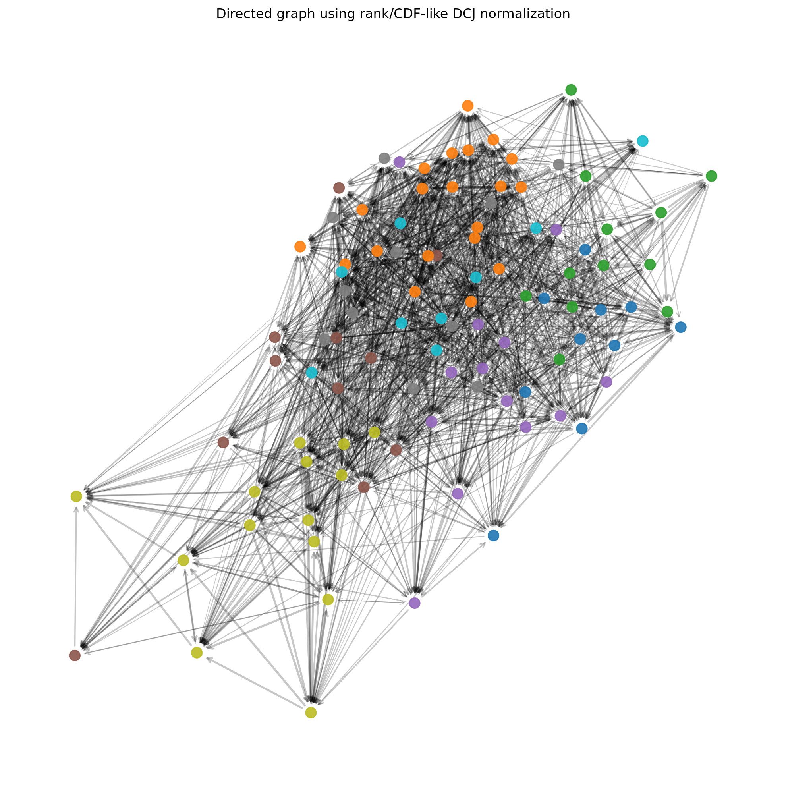

# Plasmid-Similarity-Network
Plasmid similarity network construction using containment distance and DCJ–Indel structural distance.

## Plasmid Distance Network Simulation

This repository simulates pairwise plasmid distances using two measures:

1. **DCJ-Indel distance**: a structural rearrangement distance.
2. **Containment distance**: the proportion of a source plasmid not contained in a target plasmid.

These are combined into a bounded directed distance in \([0,1]\):

\[
d(i,j) = \max\{F(d_1(i,j)),\ d_2(i,j)\},
\]

where:

- \(d_1(i,j)\) is the DCJ-Indel distance,
- \(d_2(i,j)\) is the directed containment distance,
- \(F\) maps DCJ-Indel distances to \([0,1]\).

The repository includes multiple choices for \(F\), including:

- min-max normalization,
- exponential saturation:
  \[
  F(d) = 1 - e^{-d/\tau},
  \]
- rank / empirical CDF normalization.

The resulting combined distance is converted into a directed edge inclusion probability:

\[
p(i,j) = 1 - d(i,j),
\]

and used to sample a directed plasmid network.

---

## Features

- simulates plasmids with:
  - latent family structure,
  - variable lengths,
  - hub/mobile-element effects,
- generates:
  - symmetric DCJ-Indel-like distances,
  - directed containment distances,
- computes combined distances using:
  - `max(minmax(d1), d2)`,
  - `max(1-exp(-d1/tau), d2)`,
  - `max(rank_normalized(d1), d2)`,
- samples directed graphs with NetworkX,
- visualizes matrices and graphs with Matplotlib.

---

## Example plasmid similarity network



## Installation

### Create a virtual environment

#### macOS / Linux

```bash
python3 -m venv .venv
source .venv/bin/activate
python -m pip install --upgrade pip
pip install -r requirements.txt